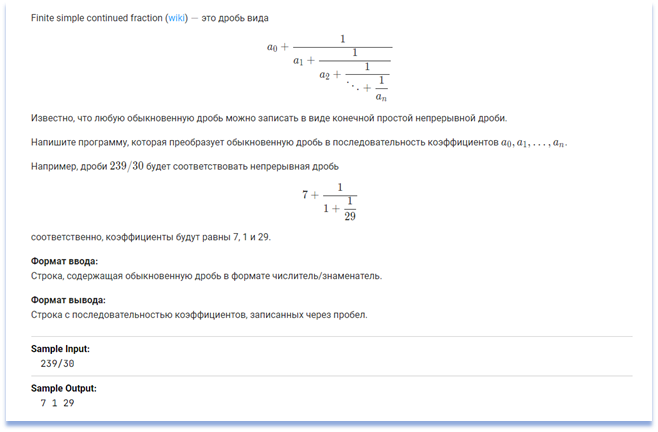
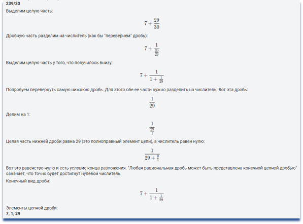

1. Implement a function for these requirements:

More information about [Continued fraction](https://en.wikipedia.org/wiki/Continued_fraction)

2. Create tests for this function. You can create tests first if you prefer TDD.

3. Create a report for a test run (pytest-html or allure).

4. Submit function implementation, tests, and a report for Code review.

